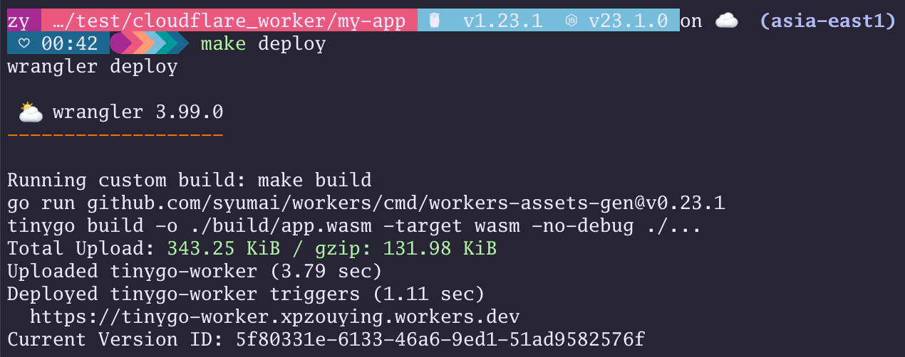

# Cloudflare Worker

## 1. 安装 Cloudflare

```bash
npm install -g wrangler

pnpm install -g wrangler
```

## 2. 登录

```bash
wrangler login
```

## 3. 创建项目

参考 [worker-tinygo example](https://github.com/syumai/workers/tree/main/_templates/cloudflare/worker-tinygo)

```bash
# 安装 gonew
go install golang.org/x/tools/cmd/gonew@latest

# 安装 TinyGo
brew tap tinygo-org/tools
brew install tinygo

# 创建项目
gonew github.com/syumai/workers/_templates/cloudflare/worker-tinygo your.module/my-app # e.g. github.com/syumai/my-app
cd my-app
go mod tidy
make dev # start running dev server
curl http://localhost:8787/hello # 输出: "Hello ZOUYING"
```

## 4. 部署

```bash
wrangler deploy
```



## 5. 在线演示

你可以测试在线演示：

```bash
curl https://tinygo-worker.xpzouying.workers.dev/hello
# 输出: Hello ZOUYING
```

## 6. Github Action

项目已配置了自动部署到 Cloudflare Workers 的 GitHub Actions。当代码推送到 main 分支时，会自动触发部署流程。

### 配置步骤：

1. 在 GitHub 仓库的 Settings -> Secrets and variables -> Actions 中添加以下 secret：
   - `CLOUDFLARE_API_TOKEN`: 从 Cloudflare 获取的 API Token

### 获取 Cloudflare API Token：

1. 登录 Cloudflare Dashboard
2. 进入 User Profile -> API Tokens
3. 创建一个新的 Token，确保有 Workers 的部署权限
4. 复制生成的 Token 并添加到 GitHub Secrets

配置完成后，每次推送到 main 分支都会自动部署到 Cloudflare Workers。

- Ref: https://github.com/cloudflare/wrangler-action
