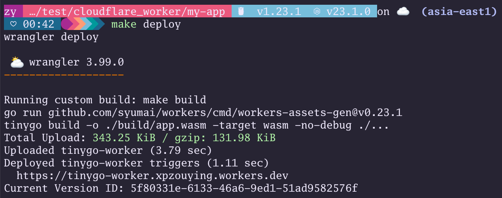

# Cloudflare Worker

[中文文档](./README.cn.md)

## 1. Install Cloudflare

```bash
npm install -g wrangler

# or
pnpm install -g wrangler
```

## 2. Login

```bash
wrangler login
```

## 3. Create Project

Reference: [worker-tinygo example](https://github.com/syumai/workers/tree/main/_templates/cloudflare/worker-tinygo)

```bash
# Install gonew
go install golang.org/x/tools/cmd/gonew@latest

# Install TinyGo
brew tap tinygo-org/tools
brew install tinygo

# Create project
gonew github.com/syumai/workers/_templates/cloudflare/worker-tinygo your.module/my-app # e.g. github.com/syumai/my-app
cd my-app
go mod tidy
make dev # start running dev server
curl http://localhost:8787/hello # outputs "Hello ZOUYING"
```

## 4. Deploy

```bash
wrangler deploy
```



## 5. Live Demo

You can test the live demo at:

```bash
curl https://tinygo-worker.xpzouying.workers.dev/hello
# Output: Hello ZOUYING
```

## 6. Github Action

This project is configured with GitHub Actions for automatic deployment to Cloudflare Workers. Deployments are triggered automatically when code is pushed to the main branch.

### Configuration Steps:

1. Add the following secret in your GitHub repository under Settings -> Secrets and variables -> Actions:
   - `CLOUDFLARE_API_TOKEN`: API Token from Cloudflare

### How to Get Cloudflare API Token:

1. Login to Cloudflare Dashboard
2. Go to User Profile -> API Tokens
3. Create a new Token with Workers deployment permissions
4. Copy the generated Token and add it to GitHub Secrets

Once configured, every push to the main branch will automatically deploy to Cloudflare Workers.

- Ref: https://github.com/cloudflare/wrangler-action
