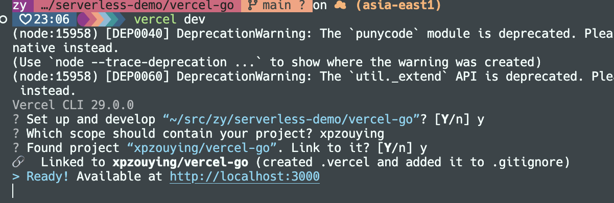
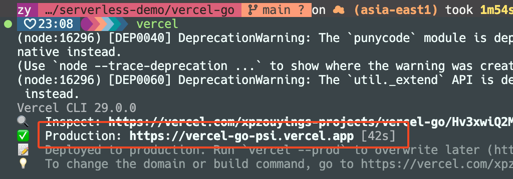

# Vercel Go

```
https://vercel.com/docs/functions/runtimes/go
```

## How to run

```bash
# dev
vercel dev
```



## Check Demo

Open the url: [http://localhost:3000/api](http://localhost:3000/api)

## How to public

```bash
vercel
```

Build success,



Open the url: [https://vercel-go-psi.vercel.app/api](https://vercel-go-psi.vercel.app/api)

NOTE:

- The url should be end with `/api`.
